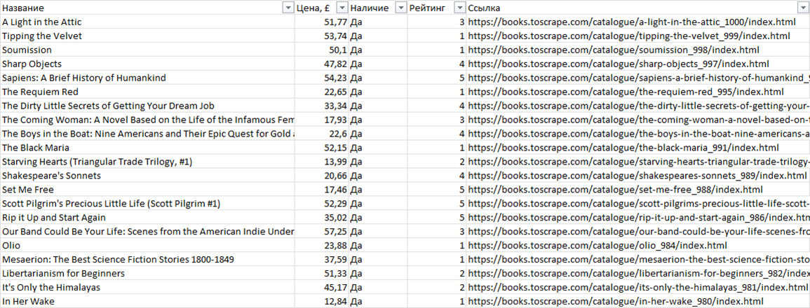

# books-parser

Собирает каталог интернет-магазина в Excel: название, цена, наличие, рейтинг и ссылка на каждый товар. Сам проходит все страницы, можно взять только одну категорию.



Для примера используется [books.toscrape.com](https://books.toscrape.com/) - это открытый демо-магазин, специально сделанный для отработки парсинга (1000 книг, 50 страниц). Под другой магазин меняются адрес и селекторы в функции `parse_book`, остальное остается как есть.

Между запросами есть пауза, при ошибке загрузки страницы 3 повторные попытки - чтобы не положить сайт и не потерять данные из-за одного таймаута.

## Запуск

```
pip install -r requirements.txt
python parser.py
```

Весь каталог собирается примерно за минуту в `books.xlsx`. Другие варианты:

```
python parser.py --pages 3
python parser.py --list-categories
python parser.py --category Mystery --output mystery.xlsx
```

В файле цены сохраняются числами, шапка закреплена и включен фильтр - можно сразу сортировать по цене или рейтингу.
